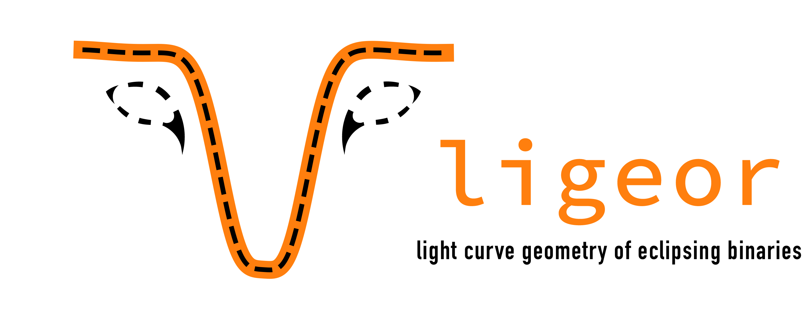

<div align="center">
  
</div>

*ligeor* (LIght curve GEOmetRy) fits analytical models to eclipsing binary light curves, 
designed to quickly estimate the geometric properties of the eclipses: positions, widths and depths.
Additionally, you can use the built-in MCMC samplers to refine the ephemerides and provide 
posterior distributions for the periods, t0s and eclipse parameters.

The two-Gaussian model implementation is based on [Mowlavi et. al (2017)](https://ui.adsabs.harvard.edu/abs/2017A%26A...606A..92M/abstract). The polyfit model is described in [Prsa et al. (2008)](https://ui.adsabs.harvard.edu/abs/2008ApJ...687..542P/abstract).
In addition to being able to fit an analytical model, samplers are build on top of [emcee](https://emcee.readthedocs.io/en/stable/) that allow for sampling of the posterior parameter space of the models and ephemerides. 

The result of the fitting and/or sampling is geometrical eclipse parameter estimates (positions, widths and depths) that can serve as a starting point in more robust analysis.


### Getting Started

*ligeor* depends on the following packages:
   * numpy
   * scipy
   * emcee

and optionally, to run distribution math:
   * distl

Install *ligeor* from pip
```
pip install ligeor
```

or from source
```
python setup.py build
python setup.py install # --user (if local installation, otherwise global)
```

### Basic Usage

**Fitting a model to a light curve**
```
from ligeor import TwoGaussianModel

model = TwoGaussianModel(filename=filename, delimiter=',', usecols=(0,1,2), phase_folded=True)
model.fit()
model.plot()
_ = model.compute_eclipse_params()
print(model.eclipse_params)
```

**MCMC for ephemerides refinement and eclipse parameter distributions**
```
from ligeor import EmceeSamplerPolyfit 

sampler = EmceeSamplerPolyfit(filename, period, t0, delimiter=' ', usecols = (0,1,2))
sampler.run_sampler()
sampler.compute_results(burnin=1000)
```
